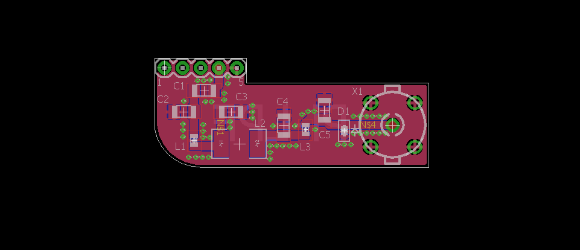

Low pass filter to use with RPi and WSPR

Bill of Materials:

Part Value       MPN

C1   0.1uF       12061C104JAT2A                     
C2   56pF        12061A560JAT2A                     
C3   150pF       12062A151JAT2A                     
C4   150pF       12062A151JAT2A                     
C5   56pF        12061A560JAT2A                     
D1               ESD8351XV2T1G                      
L1   300nH       0603HP-R30X_LU                     
L2   390nH       1206CS-391XGLB                     
L3   300nH       0603HP-R30X_LU                     
X1   BNC         5-1634503-1 

Note: Capacitors and Inductors chosen for 10M band use

